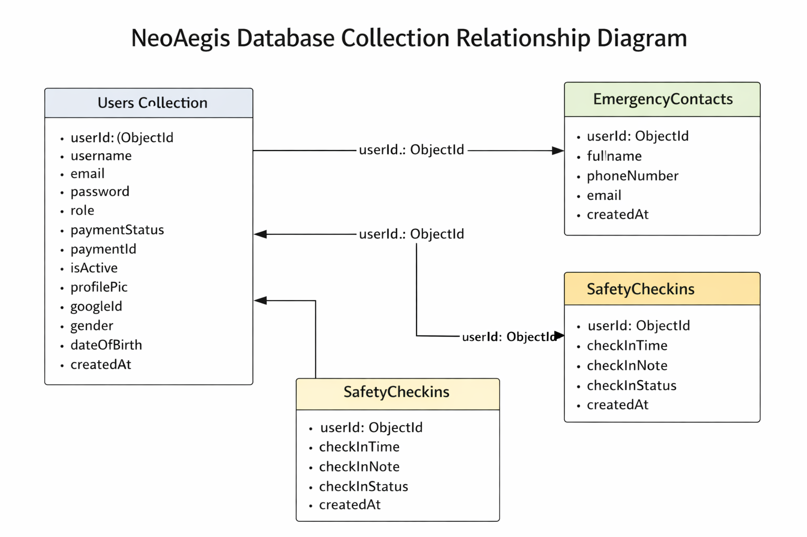

# 🛡️ NeoAegis — Personal Safety & Emergency Response Platform

> A production-deployed full-stack MERN application providing real-time emergency alerting, automated safety check-ins, emergency contact management, email breach monitoring and subscription-based access control.

🔗 **Live:** [neoaegis.anugrahshanoj.in](https://neoaegis.anugrahshanoj.in)

---

## 📌 What is NeoAegis?

NeoAegis is a personal safety platform built for real-world use. The idea is simple — if something goes wrong, the people who matter should know immediately and be able to find you.

The platform allows users to trigger instant SOS alerts with live location tracking, schedule automated safety check-ins that escalate to contacts if missed, manage a trusted emergency contact network, and monitor their digital exposure through email breach detection — all behind a secure subscription-based access model.

This project was built end-to-end — from schema design and API architecture to UI, real-time communication, payment integration and a full production deployment on AWS.

---

## 🧠 Tech Stack

| Layer | Technologies |
|---|---|
| Frontend | React, Vite, Tailwind CSS, Framer Motion, React-Leaflet, Socket.io Client |
| Backend | Node.js, Express.js, Passport.js, Socket.io, Nodemailer, Node-cron |
| Database | MongoDB Atlas with Mongoose ODM |
| Auth | JWT, bcrypt, Google OAuth 2.0 via Passport.js |
| Payment | Razorpay — order creation + server-side HMAC signature verification |
| Infrastructure | AWS EC2, Nginx, Certbot (SSL/HTTPS), PM2 |

---

## 🏗️ System Architecture


- All incoming traffic hits **Nginx first** — it routes static requests to the React build and API requests to the Node.js backend internally
- The backend is **not publicly exposed** — only Nginx is accessible from outside
- Google OAuth is handled under a separate `/auth` route because it is a browser redirect, not an API call
- HTTP (port 80) automatically redirects to HTTPS (port 443)
- PM2 keeps the Node.js process alive and auto-restarts on crash or server reboot

---

## ☁️ Production Deployment

| Component | Details |
|---|---|
| Cloud Provider | AWS EC2 — t3.micro, Ubuntu 24.04 LTS, Mumbai region |
| Web Server | Nginx — reverse proxy + static file serving |
| Process Manager | PM2 — keeps backend alive, auto-restarts on crash or reboot |
| Database | MongoDB Atlas — cloud hosted, not co-located on EC2 |
| SSL Certificate | Certbot (Let's Encrypt) — HTTPS enforced, auto-renews every 90 days |
| Domain | Custom domain via Namecheap — subdomain A record mapped to EC2 public IP |
| Server Timezone | Configured to Asia/Kolkata (IST) for accurate cron-based scheduling |

---

## 🚀 Core Features

### 🔐 Authentication & Access Control
- JWT-based authentication with 7-day token expiry
- bcrypt password hashing via Mongoose pre-save hook — plain passwords never stored
- Google OAuth 2.0 Single Sign-On via Passport.js
- Hybrid login — Google SSO users can optionally set a manual password to enable both login methods
- Subscription gate — users without an active payment are redirected to the payment page on every access attempt

### 🚨 SOS Alert System
- One-tap SOS trigger capturing live GPS coordinates via the browser Geolocation API
- Real-time location streamed to emergency contacts via Socket.io
- Auto-expiring tokenized tracking links (3-hour validity) delivered instantly by email
- Tracking link is immediately invalidated the moment the user resolves the alert
- Alert lifecycle: `Pending → Acknowledged → Resolved`

### 📅 Safety Check-ins
- Users schedule recurring check-ins with a custom name and time
- A grace period window is applied — escalation only fires if the check-in is genuinely missed
- Automated escalation via Node-cron — all emergency contacts are emailed with a Confirm Safe link if a check-in is missed
- Contacts can confirm the user is safe directly from the email without logging in
- Check-in lifecycle: `Pending → Completed → Missed`

### 👥 Emergency Contact Management
- Add and manage up to 4 trusted emergency contacts per user
- Test alert feature — sends a real email to verify delivery before any emergency
- All contact data is scoped strictly to the authenticated user

### 🔍 Email Breach Detection
- Checks the user's registered email against global data breach databases via an external API
- Returns breach source, date, and type of data exposed (passwords, phone numbers, etc.)
- Promotes proactive digital security awareness

### 💳 Subscription & Payment
- Razorpay payment gateway with backend order creation
- Server-side HMAC signature verification ensures payment authenticity
- Payment status persisted in user schema — gates access to the entire platform
- One-time activation model — no recurring charges

---

## 🗄️ Database Design



All collections reference `userId` for strict user-level data isolation. Relationships are handled at the application level using MongoDB referencing — no joins.

### Users
```
_id, username, email, password (bcrypt), role, googleId,
paymentStatus, paymentId, profilePic, gender, dateOfBirth,
isActive, createdAt
```

### EmergencyContacts
```
_id, userId (ref → Users), fullname, email, phoneNumber, createdAt
```
Max 4 contacts per user — enforced at API level.

### SOSAlerts
```
_id, userId (ref → Users), location { latitude, longitude, city },
message, status, trackingToken, tokenExpiresAt, createdAt
```
`status: "Pending" | "Acknowledged" | "Resolved"`  
Tracking token auto-invalidated on resolve.

### SafetyCheckins
```
_id, userId (ref → Users), checkInName, checkInTime,
checkInNote, checkInStatus, createdAt
```
`checkInStatus: "Pending" | "Completed" | "Missed"`  
Missed check-ins trigger automated escalation via Node-cron.

---

## 🛡️ Security Implementation

| Measure | How |
|---|---|
| HTTP Security Headers | Helmet.js applied on all API responses |
| Brute Force Protection | Rate limiting on login and registration endpoints |
| JWT Verification | Middleware validates token on every protected route |
| Password Storage | bcrypt hashing — never stored in plain text |
| Payment Integrity | Server-side Razorpay HMAC signature validation |
| CORS | Restricted to the production frontend domain only |
| OAuth Security | Passport.js with secure server-side session handling |
| SSL/HTTPS | Let's Encrypt via Certbot — enforced at Nginx level |

---

## 📂 Project Structure

```
NeoAegis/
├── backend/
│   ├── index.js
│   ├── Routes/
│   ├── Controller/
│   ├── Model/
│   ├── Middleware/
│   ├── Config/
│   └── Uploads/
├── frontend/
│   └── src/
│       ├── pages/
│       ├── components/
│       └── Services/      
└── assets/
```

---

## 📄 License

Developed for portfolio purposes. All rights reserved.
