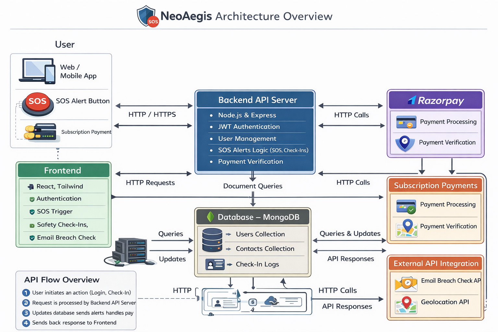

# 🛡️ NeoAegis – Personal Safety & Emergency Response Platform

A production-oriented full-stack MERN application designed to enhance personal safety through emergency alerts, safety check-ins, breach monitoring, and secure subscription-based access.

## 📌 Project Overview

NeoAegis is a real-world inspired personal safety platform built to provide rapid emergency assistance and proactive digital security awareness.

The system allows users to:

- Trigger SOS alerts instantly
- Manage trusted emergency contacts
- Schedule automated safety check-ins
- Verify email exposure in public data breaches
- Access the application through a secure subscription model

This project demonstrates secure backend architecture, structured REST API design, payment gateway integration, authentication mechanisms, and scalable MongoDB data modeling.

## 🏗️ System Architecture Diagram

Below is the high-level architecture diagram representing the complete flow of NeoAegis including frontend, backend, database, payment gateway, and external API integrations.



## 🚀 Core Features

### 🔐 Secure Authentication

- JWT-based authentication  
- Secure password hashing using bcrypt (Mongoose pre-save hook)  
- Protected API routes using middleware  
- Google OAuth integration (Single Sign-On support)  

### 🚨 SOS Emergency System

- One-tap SOS trigger  
- Captures user’s current location (latitude, longitude, city)  
- Stores SOS alert with lifecycle status tracking  
- Sends alert notifications to saved emergency contacts  
- Status flow: Pending → Acknowledged → Resolved  

### 🔔 Smart Safety Check-Ins

- Users can schedule safety check-ins  
- Stores check-in time and optional note  
- Tracks status lifecycle: Pending → Completed → Missed  
- Missed check-ins trigger escalation handling logic  

### 📞 Emergency Contact Management

- Add, remove, and manage trusted contacts  
- Phone number and email validation  
- Contacts securely mapped to authenticated user  
- User-level data isolation  

### 🔍 Email Breach Check (Cybersecurity Awareness Feature)

- Users can verify whether their email has appeared in known public data breaches  
- Integrated with external breach intelligence API  
- Encourages proactive digital security monitoring  
- Demonstrates secure third-party API consumption  

### 💳 Mandatory Subscription Access (Razorpay Integration)

NeoAegis operates on a subscription-based access model.

- Every user must complete subscription to access the application  
- Secure Razorpay payment gateway integration  
- Backend order creation and verification  
- Signature validation for payment authenticity  
- Payment status stored in user schema (`paymentStatus`, `paymentId`)  

There are no premium tiers or feature differences — subscription is required for full platform access.

## 🧠 Technology Stack

### 🖥️ Frontend

- React.js  
- Tailwind CSS  
- React Router  
- Axios  
- Geolocation API  

### ⚙️ Backend

- Node.js  
- Express.js  
- MongoDB  
- Mongoose ODM  
- JWT Authentication  
- Razorpay SDK  

## 🏗️ Architecture & Design Approach

- Stateless authentication using JWT  
- Middleware-driven request validation  
- Modular controller-based structure  
- Environment-based configuration management  
- Secure hashing and authentication workflow  
- Clean separation between routes, controllers, models, and middleware  
- Scalable MongoDB schema design  
- Secure integration of third-party APIs  

## 📂 Project Structure

```bash
NeoAegis/
│
├── backend/
│   ├── Controllers/
│   ├── Models/
│   │   ├── userSchema.js
│   │   ├── emergencyContactSchema.js
│   │   ├── safetyCheckinsSchema.js
│   │   └── sosAlertSchema.js
│   ├── Routes/
│   ├── Middlewares/
│   ├── Utils/
│   ├── index.js
│   └── configuration files
│
├── frontend/
│   ├── src/
│   │   ├── Components/
│   │   ├── Pages/
│   │   ├── Services/
│   │   ├── App.jsx
│   │   └── main.jsx
│
├── assets/
│   └── neoAegis-architecture.png
│
└── README.md


## 🛡️ Security Implementation

- bcrypt password hashing using Mongoose pre-save hook  
- JWT authentication middleware for protected routes  
- Secure Razorpay payment signature verification  
- Input validation for user and contact data  
- Environment variable protection  
- Controlled API access based on `paymentStatus`  
- Secure Google OAuth handling with unique `googleId`  

---

## 🗄️ Database Design

### 👤 Users Collection (`userSchema.js`)

Fields included in the schema:

- username  
- email  
- password  
- role  
- paymentStatus  
- paymentId  
- isActive  
- profilePic  
- googleId  
- gender  
- dateOfBirth  
- createdAt  

---

### 📞 Emergency Contacts Collection (`emergencyContactSchema.js`)

Fields included in the schema:

- fullname  
- phoneNumber  
- email  
- userId  
- createdAt  

---

### 🔔 Safety Check-Ins Collection (`safetyCheckinsSchema.js`)

Fields included in the schema:

- checkInTime  
- checkInNote  
- checkInStatus  
- userId  
- createdAt  

---

### 🚨 SOS Alerts Collection (`sosAlertSchema.js`)

Fields included in the schema:

- userId  
- location (latitude, longitude, city)  
- message  
- status  
- timestamp  
- createdAt  

---

## 🎯 Engineering Highlights

- Clean REST API architecture  
- Secure authentication workflow  
- Razorpay payment gateway integration  
- External breach intelligence API integration  
- Automated safety check escalation logic  
- Structured MongoDB schema modeling  
- Robust validation and middleware handling  

---

## 📄 License

This project is developed for portfolio and educational purposes.
